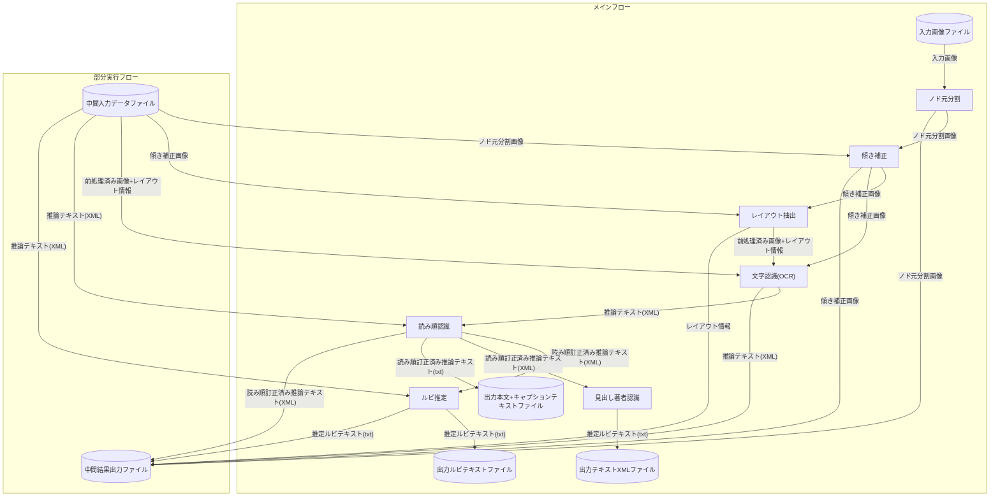

# ndlocr_cli(NDLOCR(ver.2.1)アプリケーションのリポジトリ)

NDLOCR(ver.2)を利用してテキスト化を実行するためのアプリケーションを提供するリポジトリです。 

本プログラムは、令和4年度NDLOCR追加開発事業の成果物である[ver.2.0](https://github.com/ndl-lab/ndlocr_cli/tree/ver.2.0)に対して、国立国会図書館が改善作業を行ったプログラムです。

事業の詳細については、[令和4年度NDLOCR追加開発事業及び同事業成果に対する改善作業](https://lab.ndl.go.jp/data_set/r4ocr/r4_software/)をご覧ください。

本プログラムは、国立国会図書館がCC BY 4.0ライセンスで公開するものです。詳細については LICENSEをご覧ください。

**2023年6月まで公開していたバージョンを継続して利用したい場合には、[ver.1](https://github.com/ndl-lab/ndlocr_cli/tree/ver.1)をご利用ください。**
```
git clone --recursive https://github.com/ndl-lab/ndlocr_cli -b ver.1
```
のようにソースコード取得部分を書き換えることで継続してお使いいただけます。


## 環境構築

### 1. リポジトリのクローン
本リポジトリはNDLOCRの処理を統合する機能のみを有しています。

OCRを実現するための各機能はhttps://github.com/ndl-lab
に存在する複数のリポジトリに切り分けられており、

本リポジトリとの間をsubmoduleで紐づけています。

リポジトリをclone する際は、次のコマンドを実行すると、関連リポジトリを一度に取得することができます。
```
git clone --recursive https://github.com/ndl-lab/ndlocr_cli
```
### 2. ホストマシンのNVIDIA Driverのアップデート
コンテナ内でCUDA 11.1を利用します。

ホストマシンのNVIDIA Driverが

Linuxの場合: 450.36.06以上 

Windowsの場合:520.06以上

のバージョンを満たさない場合は、ご利用のGPUに対応するドライバの更新を行ってください。

（参考情報）

以下のホストマシン環境（AWS g5.xlargeインスタンス）上で動作確認を行っています。

OS: Ubuntu 18.04.6 LTS

GPU: NVIDIA A10G

NVIDIA Driver: 470.182.03


### 3. dockerのインストール
https://docs.docker.com/engine/install/
に従って、OS及びディストリビューションにあった方法でdockerをインストールしてください。

### 4. dockerコンテナのビルド
Linux:
```
cd ndlocr_cli
sh ./docker/dockerbuild.sh
```

Windows:
```
cd ndlocr_cli
docker\dockerbuild.bat
```

### 5. 処理したい画像の入ったディレクトリのマウント方法

[./docker/run_docker.sh](./docker/run_docker.sh)を書き換えて、-vを追加してホストマシンのディレクトリを指定することでホストマシンのディレクトリをマウントすることができます。
（※-vオプションは-iオプションよりも手前で指定してください。）

Linux:

例：/home/user/tmpdirの直下に画像ファイルがある場合
```
docker run --gpus all -d --rm --name ocr_cli_runner -v /home/user/tmpdir:/root/tmpdir/img -i ocr-v2-cli-py38:latest
```


### 6. dockerコンテナの起動
Linux:
```
cd ndlocr_cli
sh ./docker/run_docker.sh
```

Windows:
```
cd ndlocr_cli
docker\run_docker.bat
```


## 環境構築後のディレクトリ構成（参考）
```
ndlocr_cli
├── main.py : CLIコマンドを実行するためのPythonスクリプト
├── cli : CLIコマンドの利用するPythonコード
├── submodules : 各推論・評価処理のソースコード用ディレクトリ(※Dockerビルド前に作成するディレクトリ)
│   ├── separate_pages_mmdet : ノド元分割のソースコード
│   ├── deskew_HT : 傾き補正のソースコード
│   ├── ndl_layout : レイアウト抽出処理のソースコード
│   ├── text_recognition_lightning : 文字認識・見出し著者認識処理のソースコード
│   ├── reading_order : 読み順認識処理のソースコード
│   ├── ruby_prediction : ルビ推定処理のソースコード
│   └── ocr_line_eval_script : 推論結果の評価処理のソースコード
├── config.yml : サンプルの推論設定ファイル
├── eval_config.yml : サンプルの評価設定ファイル
├── docker : Dockerによる環境作成のスクリプト類
├── README.md : このファイル
├── requirements.txt : Python の必要パッケージリスト
├── LICENSE : 本リポジトリのライセンスファイル
└── LICENSE_DEPENDENCIES : 本リポジトリのプログラムが利用するパッケージのライセンスファイル
```

## チュートリアル
### Dockerの生成と実行  
起動後は以下のような`docker exec`コマンドを利用してコンテナにログインできます。

```
docker exec -it ocr_cli_runner bash
```

### 推論処理の実行

single形式(inputディレクトリ直下にimgディレクトリが存在する)のinputディレクトリ構成であれば、以下のコマンドで実行することができます。
```
python main.py infer input_data_dir output_dir -s s
```


## 各種実行時オプションについて
### 推論処理の実行時オプション
#### `-d`/`--dump`オプション
各サブ機能中間出力を全てdumpする場合は`-d`オプションを追加してください。
中間出力結果のファイルは出力ディレクトリ配下の`dump`ディレクトリに保存されます。
- `-d`オプション有効時の出力例

```
output_dir/
├── PID
│   ├── dump
│   │   ├── 0_page_sep
│   │   │   └── pred_img
│   │   ├── 1_page_deskew
│   │   │   ├── pred_img
│   │   │   └── xml
│   │   ├── 2_layer_ext
│   │   │   ├── pred_img
│   │   │   └── xml
│   │   ├── 3_line_ocr
│   │   │   ├── pred_img
│   │   │   └── xml
│   │   ├── ex1_line_order
│   │   │   ├── pred_img
│   │   │   └── xml
│   │   ├── ex2_ruby_read
│   │   │   ├── pred_img
│   │   │   └── xml
│   │   └── ex3_line_attribute
│   │       ├── pred_img
│   │       ├── txt
│   │       └── xml
│   └── txt
└── opt.json
```

#### `-p, --proc_range`オプション
入力形式によらず、推論処理の部分実行を行うときは`-p`オプションを利用します。
例えば[ノド元分割]〜[レイアウト抽出]を実行する場合は以下のようなコマンドとなります。
```
python main.py infer input_data_dir output_dir -p 0..2
```

`-p`オプションに与えるサブ機能番号に対応する各機能は以下のとおりです。

- 0: ノド元分割
- 1: 傾き補正
- 2: レイアウト抽出
- 3: 文字認識(OCR)

以下の機能はコマンド引数ではなく設定ファイルの`config.yml`で実行するかどうかを設定します。

- ex1: 読み順認識(設定ファイルの変数名：line_order)
- ex2: 漢字ルビ推定(設定ファイルの変数名：ruby_read)
- ex3: 見出し・著者認識(設定ファイルの変数名：add_title_author)

#### `-s, --input_structure`オプション
入力形式を指定するためのオプションです。
入力形式のパターンについては後述の入出力形式（推論処理）をご覧ください。

#### `-i, --save_image`オプション
推論処理の際にテキストデータだけでなく、画像データも出力するようにするためのオプションです。
本オプションが有効な場合、出力ディレクトリ内の`pred_img`ディレクトリに最後のサブ機能による処理が
実行された後の画像ファイルが出力されます。  
例えば、`-p`オプションによって[ノド元分割]〜[傾き補正]の部分実行が行われた場合、
傾き補正が行われた後の画像がファイルとして保存されます。

#### `-x, --save_xml`オプション
推論処理の際にテキストデータだけでなく、XMLデータも出力するようにするためのオプションです。
本オプションが有効な場合、出力ディレクトリ内の`xml`ディレクトリに最後のサブ機能による処理が
実行された後のXMLファイルが出力されます。
例えば全てのサブ機能による処理が実行された場合、
本オプションが有効であればテキストファイルだけでなくXMLファイルも出力ディレクトリ内に保存されます。  
ただし、推論処理がXMLデータの出力が無い範囲の部分実行である場合にはXMLファイルは出力されません。  

#### `-r, --ruby_only`オプション
ルビ推定機能のみを利用する場合に利用するためのオプションです。
本オプションが有効な場合、推論処理はルビ推定機能のみを実行し、他のサブ機能の全てをスキップします。
ただし、入力ディレクトリ内にルビ推定機能の入力となるXMLデータが存在しない場合は動作しません。

#### `-c, --config_file`オプション
推論処理の設定ファイルのパスを指定するためのオプションです。

## 入出力仕様(推論処理)
### 入力ディレクトリについて
入力ディレクトリの形式は以下の4パターンを想定しており、
それぞれ`-s`オプションで指定することができます。
(デフォルトはSigle input dir modeです)

- Sigle input dir mode(`-s s`)
```
input_root
 ├── xml
 │   └── R[7桁連番].xml※XMLデータ
 └── img
     └── R[7桁連番]_pp.jp2※画像データ
```

- Partial inference mode(`-s i`)
(過去に実行した部分実行の結果を入力とする場合はこちら)
```
input_root
 └── PID
     ├── xml
     │   └── R[7桁連番].xml※XMLデータ
     └── img
         └── R[7桁連番]_pp.jp2※画像データ
```

- Image file mode(`-s f`)
(単体の画像ファイルを入力として与える場合はこちら)
```
input_root(※画像データファイル)
```

### 出力ディレクトリ例
```
output_dir
├── PID
│   ├── dump
│   │   ├── 0_page_sep
│   │   ├── 1_page_deskew
│   │   ├── 2_layer_ext
│   │   ├── 3_line_ocr
│   │   ├── ex1_line_order
│   │   ├── ex2_ruby_read
│   │   └── ex3_line_attribute
│   ├── img
│   ├── pred_img
│   ├── txt
│   └── xml
└── opt.json
```

#### オプション情報の保存
出力ディレクトリには、パース済みの実行オプションが`opt.json`に保存されています。

#### 推論結果(画像、XML)の保存
推論結果の画像やXMLファイルを保存するように`-s`, `-x`オプションが有効な状態で実行した場合、
それぞれ`pred_img`, `xml`ディレクトリに保存されます。

#### 部分実行時の仕様
`-p`オプションを指定していた場合、`-i`, `-x`オプションの有無と関係なく`pred_img`, `xml`ディレクトリのデータは保存され、
更に最後の推論プロセスで入力として使用した画像が`img`ディレクトリに保存されます。
つまり、推論結果を重畳した画像が`pred_img`, 前処理のみ行われた画像が`img`ディレクトリに保存されます。
前処理のみ行われた画像を保存するのは、この出力ディレクトリを別の部分実行の入力ディレクトリとして利用できるようにするためです。

### 推論処理のデータフロー



## GPUメモリに関する設定
本モジュールは`mmdetection`を利用しており、実行環境に応じて`mmdetection`のGPUメモリ使用量に関する設定の調整が必要になることがあります。  
具体的には推論実行時にGPUのメモリ不足エラーが発生した場合、またはGPUメモリが十分に活用されていない場合に
コンテナ内で以下のファイルで定義されている`GPU_MEM_LIMIT`という定数を変更することで状況が改善する場合があります。

`/usr/local/lib/python3.8/dist-packages/mmdet/models/roi_heads/mask_heads/fcn_mask_head.py`

例えば`RuntimeError: CUDA out of memory.`というエラーが発生した場合、
`GPU_MEM_LIMIT`の行を次のように編集してGPUメモリの使用量を半減させることで
エラーの発生が抑えられることがあります

[編集前]
```
GPU_MEM_LIMIT = 1024**3 # 1 GB memory limit
```

[編集後]
```
GPU_MEM_LIMIT = (1024**3) // 2 # 500 MB memory limit
```

## Wrapperプログラムの実行

Wrapperプログラムは、NDL OCRのDockerコンテナを使用して、フォルダ内の画像に対して一括してNDL OCRによる文書解析を行います。

### 構成
Wrapperプログラムは以下の構成です。
* /docer/run_wrapper.sh
    * コンテナの起動、OCRの実行、コンテナの解放までを一括して行うシェルスクリプトです。
    * 内部でproc_ndlocr.pyを呼び出します。
* proc_ndlocr.py
    * フォルダの中の画像ファイルを一括で読み込み、連番JPGファイルへ変換してNDL OCRで処理をし、出力結果をJSONで出力します。
    * 内部でread_ndlocr_xml.pyを呼び出します。
* read_ndlocr_xml.py
    * NDL OCRの出力XMLを読み込みjson形式に変換します。

### 使い方

使い方は以下の通りです。
```
sh ./docker/run_wrapper.sh <input_dir> <output_dir>
```
* input_dir
    * 画像が格納されたディレクトリ。このディレクトリ内の画像ファイル(jpg、png、bmp)が一括で処理されます。
* output_dir
    * NDL OCRの結果が中間処理結果も含めて格納されるディレクトリ。

output_dir以下は次のようなディレクトリが作られます。
- draw
    - NDL OCRの描画結果が格納されるディレクトリ
- json
    - NDL OCRの認識結果JSONが格納されるディレクトリ
- tmpdir
    - NDL OCRのための中間処理結果が格納されるディレクトリ。

tmpdirディレクトリの下には更に以下のディレクトリが作成されます。
- img
    - NDL OCRへの入力用にjpgフォーマットかつ連番ファイル名に変更された入力画像ファイル群が格納されます。
- result
    - ndlocrの中間処理結果および認識結果が格納されます。

jsonに格納されるjsonファイルのファイル名は、input_dir下の画像ファイル名に対応します。
例えば、"<input_dir>/画像１.png"という名前のファイルを認識した最終結果は"<output_dir>/json/画像１.json"という名前で保存されます。

同様にdrawディレクトリの下の描画結果は"<output_dir>/draw/画像１.jpg"というファイル名で保存されます。

また、tmpdirディレクトリの下に"filename_mapping.json"という"<input_dir>"内の画像ファイル名と、"<output_dir>/tmpdir/img"ディレクトリ内の連番画像ファイル名との対応関係を記載したjsonファイルが出力されます。


### サブモジュールの使い方
#### proc_ndlocr.py
フォルダ内の画像に対して一括してNDL OCRによる文書解析を行います。

1. フォルダ内の画像ファイルを読み込み
2. 画像群をjpgファイルへ変換
3. jpgファイルにNDL OCR用の連番ファイル名をつけて専用フォルダへ保存
4. 連番ファイル名とオリジナルファイル名を保存しておく
5. NDL OCRの推論関数(infer)を呼び出し、レイアウト解析および文字認識
6. 出力されたXMLを読み込み、結果を描画
7. 結果画像ファイル名を元のファイル名へ変換し、結果フォルダに保存
8. XMLファイルをjsonへ変換し、対応するファイル名をつけて保存

使い方は以下の通りです。
```
python3 proc_ndlocr.py <input_dir> <output_dir>
```
proc_ndlocr.pyのinput_dirとoutput_dirは、そのままrun_wrapper.shのinput_dirおよびoutput_dirに対応します。
* input_dir
    * 画像が格納されたディレクトリ。このディレクトリ内の画像ファイル(jpg、png、bmp)が一括で処理されます。
* output_dir
    * NDL OCRの結果が格納されるディレクトリ。

output_dir以下は次のようなディレクトリが作られます。（proc_all.shの出力のeasyocrとlatexocrを除いたディレクトリ）
- draw
    - NDL OCRの描画結果が格納されるディレクトリ
- json
    - NDL OCRの認識結果JSONが格納されるディレクトリ
- tmpdir
    - NDL OCRのための中間処理結果が格納されるディレクトリ。

tmpdirディレクトリの下には更に以下のディレクトリが作成されます。
- img
    - run_ndlocr.sh用にjpgフォーマットかつ連番ファイル名に変更された入力画像ファイル群が格納されます。
- result
    - ndlocrの中間処理結果および認識結果が格納されます。

また、tmpdirディレクトリの下に"filename_mapping.json"という"<input_dir>"内の画像ファイル名と、"<output_dir>/ndlocr/img"ディレクトリ内の連番画像ファイル名との対応関係を記載したjsonファイルが出力されます。


#### read_ndlocr_xml.py
NDL OCRの出力XMLファイルを読み込み、JSONフォーマットへ変換します。proc_ndlocr.pyの中で呼び出されます。
```
python3 read_ndlocr_xml.py <input> <output> --convert
```
* input
    * NDL OCRが出力したXMLファイルです。proc_ndlocr.pyが出力した"<output_dir>/ndlocr/result/tmpdir/xml/tmpdir.sorted.xml"を指定します。
* output
    * 出力するJSONファイルです。
* --convet
    * このオプションをつけないと、NDL OCRのXMLと同じ構造のJSONファイルを出力します。オプションを付けた場合、構造をproc_ndlocr.pyのJSONファイルと近い構造のJSONファイルを出力します。これはproc_ndlocr.pyが各画像ファイルごとに対応するJSONファイルを吐き出すのに対し、これら同一ディレクトリ内のJSONをすべて１つのJSONに束ねた構造になっています。これはproc_ndlocr.py内で処理するための中間結果として使用されます。

#### JSONファイルのフォーマット
本プログラムが出力するJSONファイルは以下のようなフォーマットとなります。

```
{
  “width”:  1332,
  “height”:  1776,
  "LINES": [
    {
        "type": 本文,
        "x": 20,
        "y": 140,
        "width": 460,
        "height": 10,
        "confidence": 0.9,
        "string": "こんにちは、はろー、さようなら" 
    }
  ],
  "BLOCKS": [
    {
        "type":  “テキスト”,
        "x": 20,
        "y": 20,
        "width": 460,
        "height": 500,
        "confidence": 0.8,
        "LINES": [
           # 上記LINESと同じ構造
         ]
    },
    {
       "type":  “表組”,
        "x": 20,
        "y": 20,
        "width": 460,
        "height": 500,
        "confidence": 0.8,
        "LINES": [
         ]
    },
    {
       “type”:  “図版”,
        "x": 20,
        "y": 20,
        "width": 460,
        "height": 500,
        "confidence": 0.8,
        "LINES": [
           #図の中の文字列
         ]
    },
    {
　　 　"type":  “数式”,
        "x": 20,
        "y": 20,
        "width": 460,
        "height": 500,
        "confidence": 0.8,
        "LINES": [
           #LaTeXの数式表現文字列
         ]
    }
  ]
}  

```
このようにレイアウトのブロックを抽出して"BLOCKS"内に配列として格納し、そのブロックのカテゴリを"type"で指定しています。
また、ブロック内に含まれる文字列は"LINES"という配列に格納されます。この"LINES"の要素も"type"属性を持ちますが、この時EasyOCRで認識された文字列には"EasyOCR"というtypeがつけられます。一方LaTeX-OCRで認識された文字列は"数式"というtypeになります。


